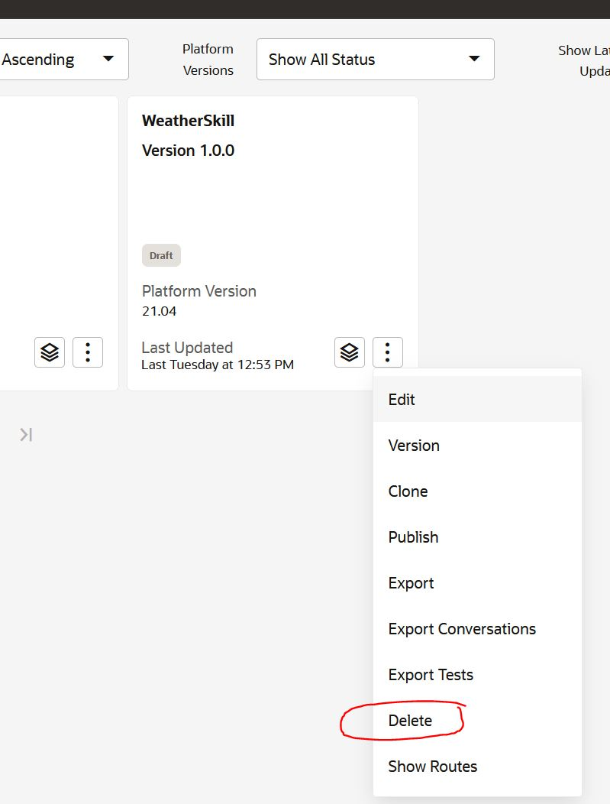
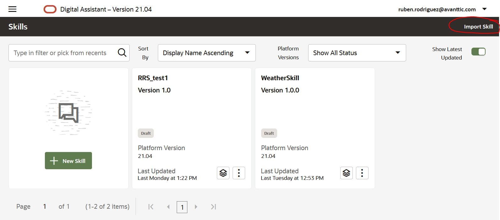

In this scenario you will be consuming an external REST service to retrieve weather information.
In Oracle Digital Assistan this can be achieved by creating a Custom Component using the SDK provided and a couple of Node.js modules.

This is the first scenario of the Oracle Digital Assistant series where you will be using the terminal and VSCode within Katacoda.

As a prerequisite for this scenario, you have to create a free account on [OpenWeatherMap API](https://openweathermap.org/) and get a API Key.

<pre>

I you had problems with the previous lab, you can download the working skill that can be imported into Oracle Digital Assistant here: https://github.com/rsantrod/katacoda-scenarios/blob/master/oda-course-redwood/oda04-skill-custom-components/assets/WeatherSkill(1.0).zip

</pre>

First make sure to remove the previous skill

Then click on import and select the downloaded file!

