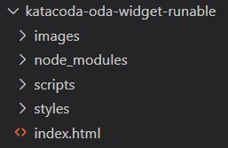

The configuration of the environment is now completed. Now you have to click on the IDE tab on Katacoda to start reviewing the different parts of the widget and configuring the ODA Channel.

As you can see in the image below, there are some folder and files that you will review during this process.

### index.html
This would be the page where you will display the widget. For example, if you want to display the widget in all the pages of your application you would include 

<pre><code>
	12    
	13    
</code></pre>